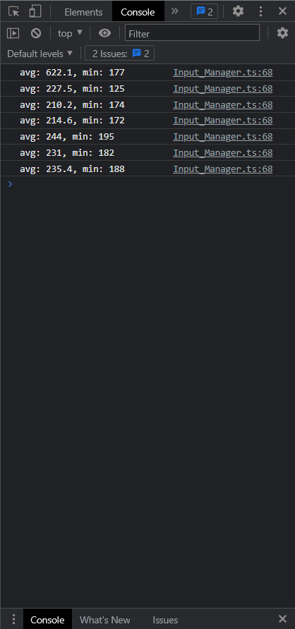

## 问题


## 采样

按压间隔实测

```typescript
const target_key = KeyCode.KEY_W;
const key_code = event.keyCode;
const FRAG = 12;

if (key_code == target_key) {
    if (this.last == - 1) {
        this.last = new Date().getTime();
    } else {
        const now = new Date().getTime(); // ms
        const interval = now - this.last;
        this.counter.push(interval);
        if (this.counter.length == 12) {
            this.counter.sort((a, b) => a - b);

            let sum = 0;
            for (let i = 1; i < FRAG; i++) {
                sum += this.counter[i];
            }

            const avg = sum / (FRAG - 2);
            const min = this.counter[1];

            console.log(`avg: ${avg}, min: ${min}`);

            this.counter = [];
        }
        this.last = now;
    }
}
```

游戏截图

-   只记录相同按键（设置为按键W）的相邻两次按压间隔
-   每12个记录保存为一组，排序后去头去尾，取平均值



